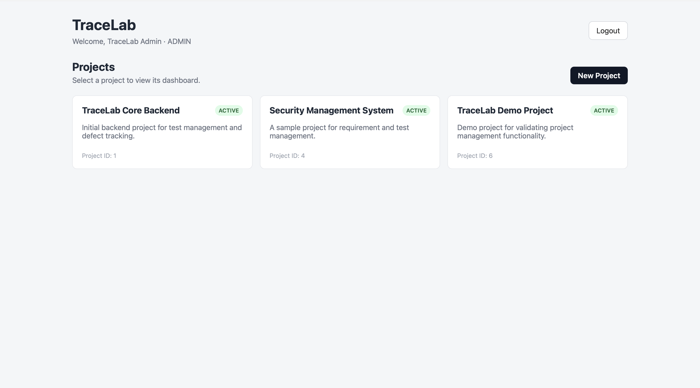
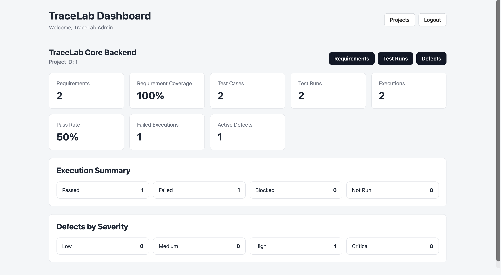
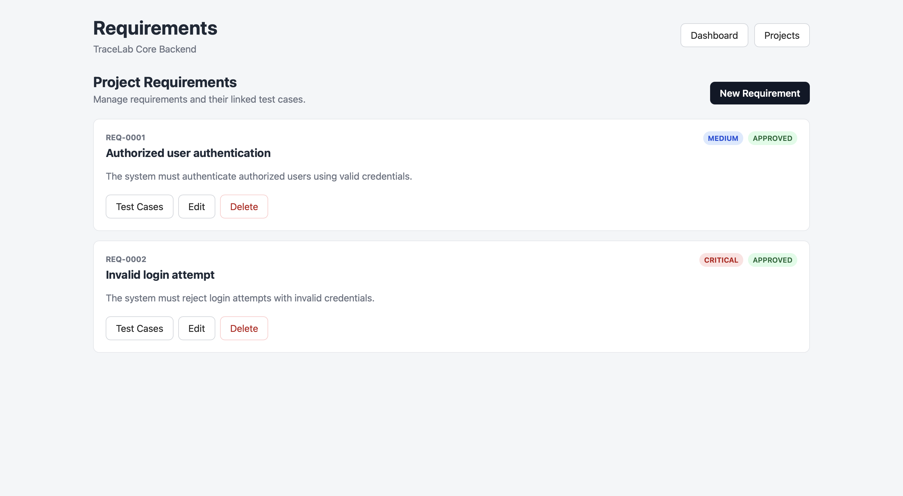
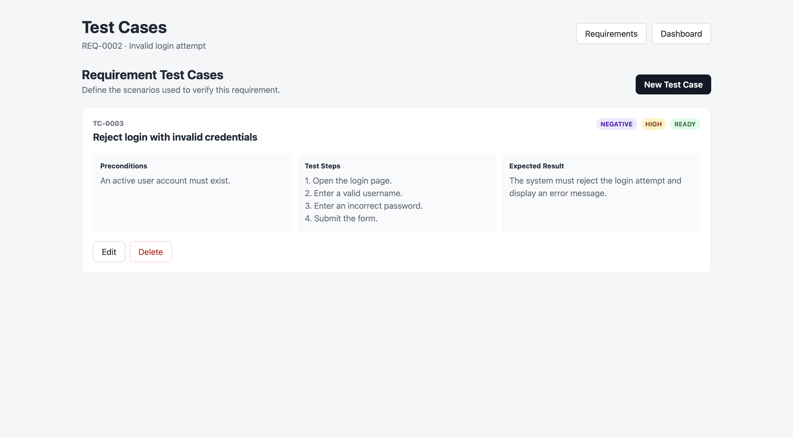
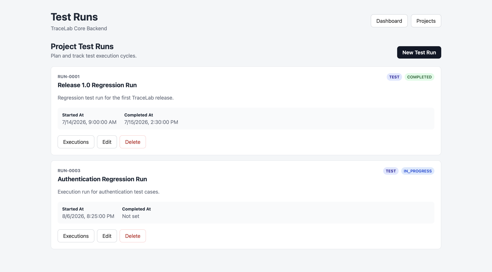
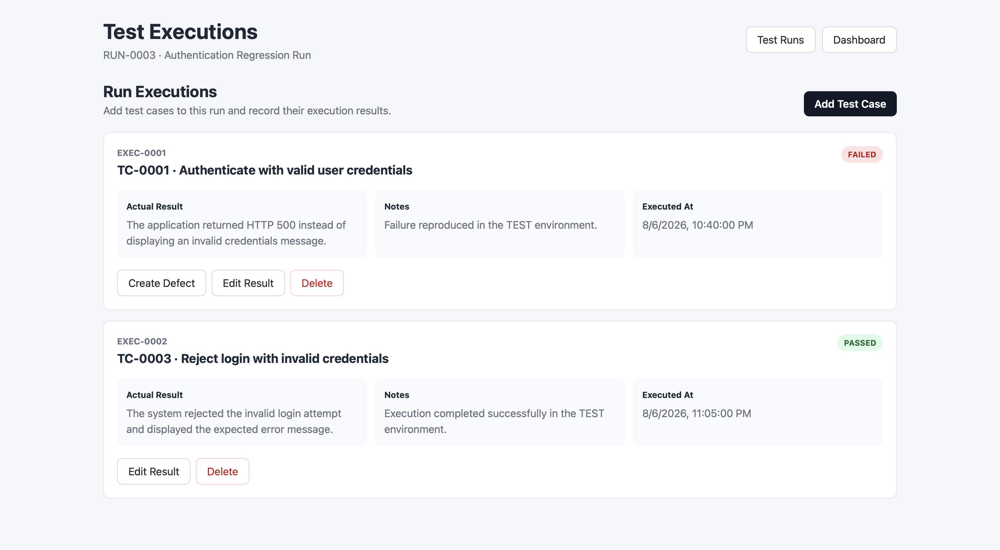
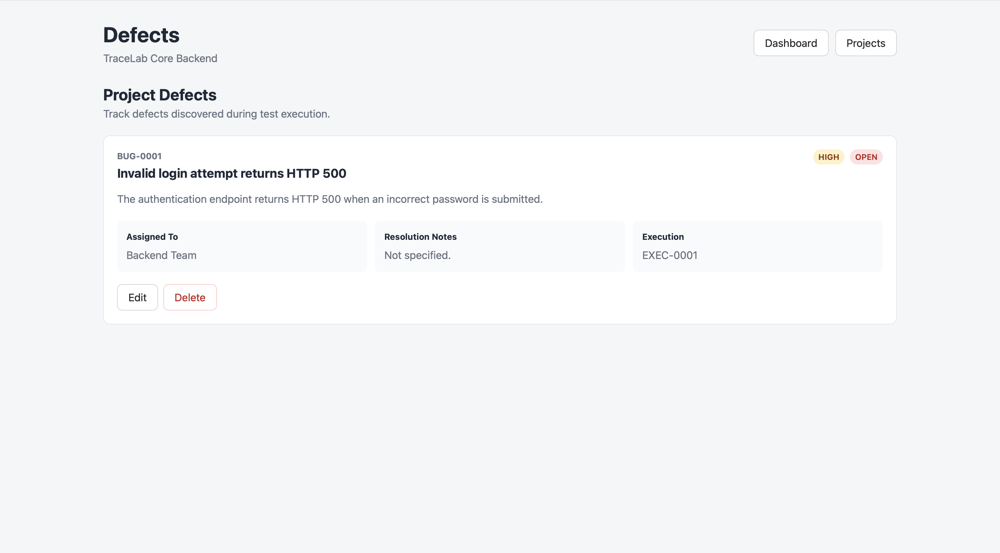

# TraceLab

TraceLab is a full-stack **test management and defect tracking system** designed to model a practical software testing workflow rather than a simple CRUD application.

It provides a structured flow from project requirements to test cases, test runs, executions, and defects, while enforcing business rules around test execution and defect management.

## Features

- Project and requirement management
- Test case creation and lifecycle management
- Test run planning for different environments
- Test execution tracking with:
  - `NOT_RUN`
  - `PASSED`
  - `FAILED`
  - `BLOCKED`
- Defect creation from failed test executions
- Defect severity, status, assignment, and resolution tracking
- Project dashboard with:
  - Requirement coverage
  - Execution statistics
  - Pass rate
  - Active defects
  - Defect severity distribution
- JWT-based authentication
- Role-based authorization with `ADMIN`, `TESTER`, and `DEVELOPER` roles
- Swagger / OpenAPI documentation
- Automated service-level tests with JUnit, Mockito, and AssertJ
- Dockerized frontend, backend, and PostgreSQL environment
- GitHub Actions CI for backend tests and frontend production builds

## Application Flow

```text
Project
├── Dashboard
├── Requirements
│   └── Test Cases
├── Test Runs
│   └── Test Executions
│       ├── PASSED
│       ├── FAILED
│       ├── BLOCKED
│       └── NOT_RUN
└── Defects
    └── Linked to FAILED Test Executions
```
- Some business rules are enforced at the backend level. For example, the same test case cannot be added twice to the same test run, completed test runs cannot be modified, and a defect can only be created for a failed execution.

## Tech Stack

### Backend

- Java 25
- Spring Boot
- Spring Web
- Spring Data JPA / Hibernate
- Spring Security
- JWT Authentication
- Maven
- PostgreSQL
- Swagger / OpenAPI
- JUnit 5
- Mockito
- AssertJ

### Frontend

- React
- Vite
- React Router
- Axios
- CSS
- Nginx

### DevOps

- Docker
- Docker Compose
- GitHub Actions

## Project Structure

```text
tracelab/
├── .github/
│   └── workflows/
│       └── ci.yml
│
├── backend/
│   ├── src/main/java/com/kaan/tracelab/
│   │   ├── auth/
│   │   ├── common/
│   │   ├── config/
│   │   ├── dashboard/
│   │   ├── defect/
│   │   ├── project/
│   │   ├── requirement/
│   │   ├── security/
│   │   ├── testcase/
│   │   ├── testexecution/
│   │   ├── testrun/
│   │   └── user/
│   ├── src/test/
│   ├── Dockerfile
│   └── pom.xml
│
├── frontend/
│   ├── src/
│   │   ├── api/
│   │   ├── components/
│   │   └── pages/
│   ├── Dockerfile
│   ├── nginx.conf
│   └── package.json
│
└── docker-compose.yml
````

## Running with Docker

Create the local environment file from the provided example:

```bash
cp .env.example .env
```

Then start the complete application:

```bash
docker compose up --build
```

After startup:

* Frontend: `http://localhost:3000`
* Swagger UI: `http://localhost:8080/swagger-ui.html`
* Backend API: `http://localhost:8080/api`

PostgreSQL runs inside Docker and its data is persisted using a Docker volume.

## Authentication and Roles

Users can register and log in through the authentication API. Passwords are stored using BCrypt hashing, and authenticated requests use Bearer JWT tokens.

Public registration creates a `TESTER` account by default.

The main authorization model is:

| Role        | Main Permissions                                                  |
| ----------- | ----------------------------------------------------------------- |
| `ADMIN`     | Full project and defect management                                |
| `TESTER`    | Requirements, test cases, runs, executions, and defect operations |
| `DEVELOPER` | Read access and defect updates                                    |

Authorization is enforced by the backend using Spring Security.

## Testing

Backend business rules are covered with automated service-level unit tests.

Run them with:

```bash
cd backend
mvn clean test
```

The current tests cover key Test Execution and Defect service scenarios, including duplicate executions, cross-project validation, failed execution rules, completed-run restrictions, and defect validation.

Frontend production build:

```bash
cd frontend
npm ci
npm run build
```

**Both checks are also executed automatically through **GitHub Actions CI** on pushes and pull requests.**

## API Documentation

Interactive API documentation is available through Swagger UI after starting the backend:

```text
http://localhost:8080/swagger-ui.html
```

JWT authentication can be supplied through Swagger's **Authorize** option when testing protected endpoints.

## Notes

TraceLab was built as a portfolio project focused on combining backend development and software testing concepts in a single application. The emphasis is on clear domain modeling, business-rule validation, authentication/authorization, automated testing, and a reproducible Docker-based development environment.

**Hayrettin Kaan Özsoy**

## Screenshots

### Project Management


### Project Dashboard


### Requirements


### Test Cases


### Test Runs


### Test Executions


### Defect Tracking
